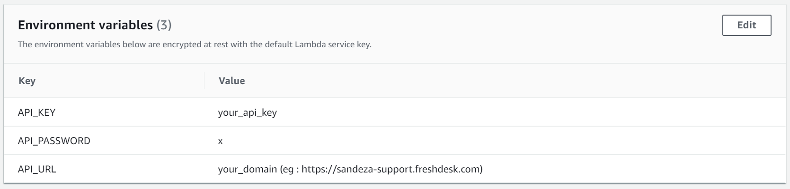

# Initial Setup

## Domain Whitelist

Open the AWS Connect instance setup page and go to `Application integration` tab then whitelist the below domain

> https://ccp.arta.sandeza.io

## Lambda

### Setup

Create new lambda function with basic execution permission with runtime `Node 12.x`  and copy the code from the <a href="https://github.com/Sandeza/arta-freshdesk-integration-lambda" target="_blank">repo</a>.

> Note : Lambda and AWS Connect instance should be in same region

Add the environment variables as shown in below image

> Note : Don't include `https://` in API_URL

### Whitelist

Open the AWS Connect instance setup page and go to `Contact flows` tab then whitelist the created lambda

## Contact Flow setup

As Shown in the below image add lambda and set contact attribute block.

Open the lambda block and select the created lambda then change the Timeout to 8sec

Open the Set contact attribute block and give same Destination key and Attribute as `customerInfo` and type as `External`

>Note : Dont't change Destination key and Attribute value

